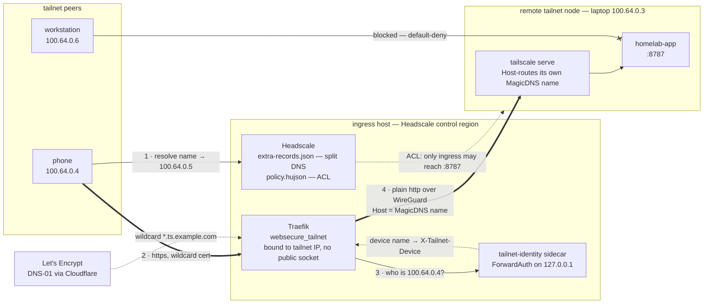

# Tailnet HTTPS Ingress (self-hosted Headscale)

Trusted HTTPS for tailnet-only services on **self-hosted Headscale** — including
services that live on **other tailnet nodes** (a note-taking app on a laptop, a
homelab box). This is the cert side of the [access gateway](access-gateways.md)
stack's [Split-DNS for VPN Services](access-gateways.md#split-dns-for-vpn-services):
split-DNS routes a tailnet hostname to the server; this issues a trusted cert for it.

## Why it exists

On real Tailscale, `tailscale serve --https` auto-issues a `*.ts.net` cert because
Tailscale owns the domain and answers the ACME challenge for you. **Headscale has
no such cert authority**, so tailnet services fall back to plain HTTP — an
*insecure context* (no service workers, PWA install, or Web Push). This reproduces
Tailscale's model with infrastructure you control: a **central ingress host issues
a wildcard cert via DNS-01** and terminates TLS for tailnet services. Hostnames
resolve **only inside the tailnet** (MagicDNS) — no public DNS record, and the
wildcard keeps individual hostnames out of Certificate Transparency logs.

## Why it needs a Cloudflare token (when nothing else does)

Every other Bay cert uses the **HTTP-01** challenge — Let's Encrypt validates by
fetching a file over public port 80, so it needs **no DNS credentials** and
auto-renews forever (the untouched `letsencrypt` resolver; see
[Certificate handling](access-gateways.md#certificate-handling)). HTTP-01 can't
serve tailnet ingress for two reasons:

1. **The service isn't publicly reachable** — HTTP-01 needs LE to reach *back* on
   public :80, and a fail-closed tailnet service has no public socket.
2. **It's a wildcard** — LE issues wildcards **only** via DNS-01.

**DNS-01** proves control via a temporary `_acme-challenge` TXT record instead of a
served file, which needs DNS-provider API access — the Cloudflare token. It's the
only new credential, and only because this is the first cert that can't be
validated over the public internet.

## Architecture



The dashed `hs → node` edge is the load-bearing one: without it, `workstation`
could reach `:8787` directly and set its own `X-Tailnet-Device`. Identity is only
as good as the ACL — see [Locking the upstream](#locking-the-upstream-headscale-acl-headscale_acl_policy).

- **Cert:** a second Traefik resolver `letsencrypt_dns` (ACME DNS-01, Cloudflare).
  One wildcard (`*.ts.example.com`) covers every tailnet route.
- **Remote upstreams:** Traefik's **file provider** renders a router per
  `tailnet_proxies` entry pointing at any tailnet URL — something Docker-label
  routing (local containers only) cannot express.
- **Resolution:** the control host's Headscale config maps each proxy domain to
  its tailnet IP via split-DNS + `extra-records.json`. No public record.
- **Fail-closed (optional):** with `traefik_split_entrypoints`, public entrypoints
  bind the public IP and a dedicated `websecure_tailnet` binds the tailnet IP;
  tailnet routes bind `websecure_tailnet` only — no public socket, so a misconfig
  makes the service unreachable, never public.

Run it on the **Headscale control region host** (`headscale_control_region`),
co-located with the coordinator + MagicDNS. Prefer a host that doesn't serve
public sites, so the fail-closed split has a small blast radius.

## Configuration

```yaml
# group_vars/<control-region>/main.yml
traefik_dns_challenge_enabled: true
traefik_cloudflare_dns_api_token: "{{ secrets.CLOUDFLARE_DNS_API_TOKEN }}"  # Zone:DNS:Edit
tailnet_ingress_cert_domain: "*.ts.example.com"   # one wildcard for all routes

# Fail-closed listener (recommended on the ingress host; needs netplan_address):
traefik_split_entrypoints: true
vpn_entrypoints: "websecure,websecure_tailnet"     # VPN services: public(allowlisted)+tailnet
```

```yaml
# tailnet_proxies — top-level key (sibling of services:), used only on the ingress host
tailnet_proxies:
  homelab-app:
    domains: ['homelab-app.ts.example.com']   # must be under tailnet_ingress_cert_domain
    upstream: 'http://100.64.0.42:8787'   # the remote node's tailnet IP:port
    # entrypoint: websecure_tailnet       # optional override
    # pass_host_header: false             # see "Host-routing backends" below
```

### Who may enrol: the OIDC allowlist

Headscale applies **no allowlist of its own**. If `headscale_oidc_issuer` is set and
you configure nothing else, every account that issuer will authenticate can enrol a
node on your tailnet. With a public issuer (Google, GitHub) that is the whole
internet. Set at least one of these three lists:

```yaml
headscale_oidc_issuer: 'https://accounts.google.com'
headscale_oidc_client_id: '...'
headscale_oidc_client_secret: "{{ secrets.headscale_oidc_client_secret }}"

headscale_oidc_allowed_domains: ['example.com']      # email domain suffix
headscale_oidc_allowed_users: ['ops@example.com']    # exact email addresses
headscale_oidc_allowed_groups: ['engineering']       # IdP group claim values
```

Each list renders into the `oidc:` block of `config.yaml` only when it is non-empty.
`bin/bay validate` **fails** when the issuer is set and all three are empty, because a
mis-set allowlist and an absent one look identical at runtime. Apply a change with
`bin/bay deploy <env> --tags headscale`, and validate first — an invalid config
crash-loops Headscale.

An allowlist decides **who may enrol**. It does not decide what an enrolled node may
reach: that is the ACL policy. Bay ships no default `headscale_acl_policy`, so a
tailnet without one is in Headscale's default **allow-all** mode and any node that
does enrol reaches every node and port, including every `access: vpn` service.
`bin/bay validate` **warns** on that pairing (OIDC on, no ACL). Adopting a policy is a
deliberate migration with real blast radius — see
[Locking the upstream](#locking-the-upstream-headscale-acl-headscale_acl_policy).

### `expose: host` and the missing DOCKER-USER chain

Bay **deliberately does not manage a `DOCKER-USER` chain.** A Docker-published port is
DNAT'd in `PREROUTING` and never reaches the nftables `input` chain, which is where the
CrowdSec bouncer set lives. So a port published on `0.0.0.0` has no firewall in front
of it at all — the only thing that ever protected it was Docker's own destination-IP
scoping, and `expose: host` is the single switch that turns that off.

Because that is a real choice and not a typo, it must be recorded:

```yaml
accessories:
  postgres:
    port: '5432:5432'
    expose: host
    expose_host_ack: true   # yes, this port bypasses nftables and CrowdSec

services:
  api:
    ports:
      internal: 8080
      expose: host
      expose_host_ack: true
```

`bin/bay validate` **fails** on any `expose: host` without `expose_host_ack: true`, on
both the accessory and the service `ports` form. The flag changes nothing about the
rendered binding. Prefer `expose: gateway` (tailnet-only) or letting Traefik front the
service; reach for `host` only when the port genuinely must be public.

### Host-routing backends (e.g. `tailscale serve`)

By default Traefik forwards the **client's** Host (`homelab-app.ts.example.com`) to the
upstream. Some backends reject an unknown Host — most notably a service still
fronted by **`tailscale serve`**, a Go proxy that only serves the node's own
MagicDNS name and returns a bare `404 page not found` for anything else (the
request never reaches your app). Symptom: `https://homelab-app.ts.example.com` 404s,
but hitting the node's MagicDNS name directly works.

Fix: set **`pass_host_header: false`** and point `upstream` at the **MagicDNS
name** the backend accepts (not the IP) — Traefik resolves it via tailnet DNS and
sends that name as the Host:

```yaml
tailnet_proxies:
  homelab-app:
    domains: ['homelab-app.ts.example.com']
    upstream: 'http://node.example.ts.net:8787'   # MagicDNS name the backend serves
    pass_host_header: false
```

If the app also runs a same-origin/CSRF check, add `homelab-app.ts.example.com` to its
allowed-origins list — the browser's `Origin` still carries the public hostname
even though the forwarded `Host` is the MagicDNS name.

### Diagnosing a broken route

The status code tells you how far the request got, which narrows the cause to one
layer:

| Response | Reached | Likely cause |
|---|---|---|
| DNS failure | nothing | Split-DNS stale — redeploy the `headscale` tag |
| TLS / cert warning | Traefik | Hostname outside `tailnet_ingress_cert_domain`, or DNS-01 never completed |
| **404** (bare `404 page not found`) | the backend node | Backend Host-routes and got the client's Host — see above |
| **500** | Traefik | ForwardAuth unreachable. Traefik is `network_mode: host`, so the sidecar must be addressed on published loopback, not a container name |
| **502** | Traefik, cert, router and ForwardAuth all fine | Upstream unreachable — backend down, or the ACL doesn't grant ingress→`node:port` |
| **200** | everything | — |

A 502 is therefore a *useful* result when adding a route: it proves resolution, the
cert, the router and identity injection all work, and isolates the problem to the
upstream.

> **Probe from a peer, not from the ingress host.** A request originating on the
> host that serves the route never crosses the tailnet packet filter, so it returns
> 200 even when the ACL blocks every other node. Curl from a second tailnet device
> — a denied flow times out (curl exit 28) rather than refusing.

Hosts that leave these unset render **byte-identically** to before. Deploy with
`bin/bay deploy production --tags traefik,headscale`, then verify: from a tailnet
device *other than the ingress host* `https://homelab-app.ts.example.com` is a
trusted, secure context; from off the tailnet `nmap -p443 <ingress-public-ip>` shows
the hostname unreachable.

## Day 2: renewals and adding apps

**Setup is one-time; operation is automatic.** The token and first deploy happen
once. After that:

- **Renewals are unattended.** 90-day certs auto-renew (~every 60 days) by
  re-running the DNS-01 challenge with the stored token — so the token is an
  *ongoing* credential, not a one-shot. Drop it after first issuance and HTTPS
  breaks silently within ≤90 days.
- **Another tailnet app = one declaration + a deploy** — *if* the tailnet is
  allow-all. Append a `tailnet_proxies` entry and redeploy `traefik,headscale`.
  **No new token, cert, or DNS record** — the wildcard already covers the new
  subdomain and split-DNS regenerates.
- **Under `headscale_acl_policy`, it is one declaration + an ACL edit + a deploy.**
  A new upstream port is not reachable until the policy names it, and the
  declaration alone gives you a route that 502s. If the route also sets
  `identity_inject`, the ACL edit is *two* changes, not one — see
  [Adding a proxy under default-deny](#adding-a-proxy-under-default-deny).

**Why the token is in the vault, not a `.env`:** the deploy loads `secrets.*` from
the encrypted `group_vars/<env>/secrets.yml` (nothing in `bin/bay` sources a
project-root `.env`) and renders it into `{{ stack_dir }}/env/traefik.env` (0600)
on the host. The vault is encrypted, committed, and portable — any deploy host (CI,
build server, another laptop) decrypts it with `.vault_pass`; a `.env` is gitignored
and exists only on the machine that made it.

> **Rotation caveat — the only recurring obligation.** If you revoke or rotate the
> Cloudflare token, update the vault entry too, or the next unattended renewal
> (~60 days out) fails and the cert expires. Otherwise it's set-and-forget.

## Variable reference

| Variable | Default | Purpose |
|---|---|---|
| `traefik_dns_challenge_enabled` | `false` | Enable the `letsencrypt_dns` resolver + file provider |
| `traefik_cloudflare_dns_api_token` | `""` | CF token (vault ref) → `CF_DNS_API_TOKEN` |
| `traefik_dns_provider` | `cloudflare` | Traefik dnsChallenge provider |
| `traefik_dns_resolver_name` | `letsencrypt_dns` | Resolver name used by proxy routers |
| `tailnet_ingress_cert_domain` | (per-proxy host) | Wildcard SAN for the cert |
| `traefik_split_entrypoints` | `false` | Fail-closed: bind public IP + add `websecure_tailnet` |
| `traefik_public_bind_ip` | `netplan_address` | Public IP for `web`/`websecure` in split mode |
| `vpn_entrypoints` / `public_entrypoints` | `websecure` | Per-router entrypoints (router labels) |
| `tailnet_proxies` | (undefined) | Map of remote tailnet routes |
| `headscale_acl_policy` | (undefined) | HuJSON ACL (file mode). Undefined = allow-all; defining it = default-deny |
| `headscale_oidc_allowed_domains` | `[]` | Email domain suffixes allowed to enrol via OIDC |
| `headscale_oidc_allowed_users` | `[]` | Exact email addresses allowed to enrol via OIDC |
| `headscale_oidc_allowed_groups` | `[]` | IdP group claims allowed to enrol via OIDC (validate fails if all three are empty and an issuer is set) |
| `traefik_metrics_bind_ip` | `127.0.0.1` | Interface the unauthenticated metrics entrypoint binds to |
| `traefik_tls_min_version` | `VersionTLS12` | `tls.options.default.minVersion` |
| `traefik_tls_sni_strict` | `false` | Refuse requests with no SNI (also refuses raw-IP access) |
| `nftables_container_host_ports` | `[]` | Empty = accept all container→host traffic (as before); non-empty narrows to those ports |
| `nftables_forward_permissive` | `true` | Keep the bare `accept` in the `forward` chain |
| `tailnet_identity_enabled` | `false` | Run the identity ForwardAuth sidecar on the ingress host |
| `tailnet_identity_source` | `api` | IP→device source: `api` (HTTP API, no mount — recommended) or `sqlite` (DB read, mounts state) |
| `tailnet_identity_api_key` | `""` | Headscale API key (vault ref) — required when source is `api` |
| `tailnet_identity_unknown_action` | `pass` | Unknown client IP: `pass` (200 + `unknown`) or `deny` (403) |
| `<proxy>.identity_inject` | `false` | Per-route opt-in to the identity header |

## Notes & gotchas

- **One wildcard per zone.** All proxy hostnames should share one
  `tailnet_ingress_cert_domain`; a hostname outside it triggers a separate cert.
- **Split-DNS staleness** (as with VPN services): after changing `tailnet_proxies`,
  redeploy the `headscale` tag so `extra-records.json` updates (hot-reloads via the
  file watcher).
- **Remote upstream is plain HTTP over WireGuard** (the tunnel encrypts it).
  Restrict the upstream port to the ingress host with a Headscale ACL so the
  backend isn't reachable by every tailnet peer — and re-check that restriction
  every time you add a proxy, since a new port lands inside existing ranges by
  default. See [Adding a proxy under default-deny](#adding-a-proxy-under-default-deny).
- **Rig routers on the split host bind both entrypoints.** When
  `traefik_split_entrypoints` is on, `websecure` is public-IP-only, so any rig
  router the *host itself* reaches over the tailnet must also bind
  `websecure_tailnet`. The **Zot registry** is the case that bites: the infra
  build host pins `registry.<domain>` to its own tailnet IP (to avoid a
  public-IP hairpin on large layer pushes), so a registry router on `websecure`
  alone 404s every infra-originated `docker push`. The framework binds the Zot
  router to both entrypoints automatically under split mode — no per-consumer
  config (GitHub #27). The `/etc/hosts` pin that points `registry.<domain>` at
  the tailnet IP is likewise framework-managed, via `zot_tailnet_pin_ip`
  (defaults to `headscale_server_tailnet_ip`; set `''` to disable). If you add
  another self-reached rig router, do the same.

## Locking the upstream: Headscale ACL (`headscale_acl_policy`)

By default Headscale is **allow-all** — every tailnet node can reach every other
node's every port. For a proxied backend that means *any* node can hit the upstream
(e.g. `laptop:8787`) directly, bypassing the ingress. Define `headscale_acl_policy`
to render a file-mode HuJSON policy on the control host and lock that down.

```yaml
# group_vars/<control-region>/main.yml  (or a dedicated headscale_acl.yml)
headscale_acl_policy:
  hosts:
    infra: 100.64.0.5/32
    laptop: 100.64.0.3/32
    workstation: 100.64.0.6/32
    phone: 100.64.0.4/32
  acls:
    # homelab-app ingress — ONLY infra may reach the upstream (so an injected identity
    # header cannot be forged by another node hitting the backend directly).
    - { action: accept, src: [infra], dst: ["laptop:8787"] }
    # per-peer SSH (by name, survives IP re-assignment)
    - { action: accept, src: [workstation, phone], dst: ["laptop:22"] }
    - { action: accept, src: [laptop], dst: ["workstation:22"] }
    # ...every other required flow (cross-region links, rig, operator)...
```

> ⚠️ **Default-deny blast radius.** The moment `headscale_acl_policy` is defined,
> Headscale switches from allow-all to **default-deny** — anything not explicitly
> `accept`-ed is blocked. You **must** enumerate every flow your tailnet relies on
> (cross-region service links, rig/monitoring, operator SSH, per-peer SSH) or you
> will cut production traffic. Validate the rendered `policy.hujson`
> (`python3 -m json.tool`), stage it, and cut over with a rollback ready
> (`git revert` the policy commit → `bin/bay deploy --tags headscale`). **Do not
> roll back by deleting the var** — that reverts the tailnet to allow-all, a far
> larger blast radius than the change being undone, and it strips the only source
> restriction left on any host whose sshd pins the ACL replaced. In file mode an
> invalid policy can stop the coordinator loading it — validate before applying.

The policy is rendered to `/opt/headscale/config/policy.hujson` and the `headscale`
container reloads on the `Restart headscale` handler.

The role validates before it installs: the rendered policy is staged to a side path,
checked with `headscale policy check`, and only then copied over the live file. An
invalid policy fails the play with headscale's own parser error, leaves the live
policy untouched, and keeps the rejected file at
`/opt/headscale/config/.policy.hujson.staged` for inspection. This matters because
the failure is otherwise badly delayed — a running tailnet coasts on its cached
policy until the container actually dies, so a crash-loop surfaces long after the
deploy that caused it. Validation is skipped, with a warning, when the headscale
image isn't present locally to run the check.

Enrolling a device that lives outside the Ansible inventory (e.g. via `bin/bay
gateway enroll`) under a default-deny policy like this one needs the same treatment
as any other node — an alias in `hosts:` plus an `accept` rule naming it as `dst`
before anything can reach it. See
[Enrolling external devices](access-gateways.md#enrolling-external-devices) in
access-gateways.md for the walkthrough.

### Adding a proxy under default-deny

Once `headscale_acl_policy` exists, a new `tailnet_proxies` entry is **not**
self-contained. Two separate edits are needed, and only the first one fails loudly.

**1. Grant the ingress host the new port** — otherwise the upstream is dead on
arrival and the route 502s:

```yaml
- action: accept
  src: [infra]
  dst: ["laptop:8787", "laptop:8788"]   # 8788 = the new proxy's upstream
```

**2. Carve the new port *out* of any broader range that already covers the node.**
This is the one that bites. Node-wide operator grants are usually written as
ranges around the ports already carved out, so a *new* port silently lands inside
them:

```yaml
# before — 8788 falls inside this range, so any operator device can reach it
  dst: ["laptop:1-8786", "laptop:8788-65535"]
# after — 8788 excluded, matching the treatment 8787 already has
  dst: ["laptop:1-8786", "laptop:8789-65535"]
```

> ⚠️ **Miss step 2 and nothing fails.** The route works, the header is injected,
> `identity_inject: true` reads as correct — and any node inside that range can
> reach the backend directly and set its own `X-Tailnet-Device`. There is no error,
> no log line, and no failing probe; the guarantee is simply gone. Accept-only ACLs
> cannot express "everything except this port," so the exclusion has to be written
> into the range by hand every time a proxied port is added.

**Rules are directional — grant both ways.** `src: [ops] dst: [node:*]` makes the
node *reachable*; it does not let the node reach anything back. Every flow the node
*initiates* needs its own rule with the node as `src`. Half-listing is the recurring
bug, and the symptom misleads: an ungranted peer is **absent from `tailscale status`
entirely**, so a policy gap looks exactly like a failed enrollment. Check the policy
before debugging the connection.

`bin/bay gateway acl audit` flags nodes that no accept rule can reach, but it
**only checks the inbound (`dst`) side** — it catches dead-on-arrival, and will
happily report a half-listed node as `reachable` when it still cannot initiate
outbound. Check the `src` side by eye.

## Per-device identity (`tailnet_identity_enabled` + `identity_inject`)

A proxied backend behind `tailscale serve` only sees the **ingress host** as the
caller — per-device identity collapses on that hop. But the ingress host itself sees
the *real* client tailnet IP (clients connect to its tailnet IP directly over
WireGuard). The `tailnet-identity` sidecar recovers identity there: a Traefik
ForwardAuth resolves the client IP → Headscale device name and injects
`X-Tailnet-Device` onto the upstream request.

```yaml
# group_vars/<control-region>/main.yml
tailnet_identity_enabled: true          # runs the sidecar on the ingress host
tailnet_identity_api_key: "{{ vault_headscale_api_key }}"   # mint once, store in vault
# tailnet_identity_source: api          # default; 'sqlite' avoids the key but mounts state

# group_vars/all/tailnet_proxies.yml
tailnet_proxies:
  homelab-app:
    domains: ["homelab-app.ts.example.com"]
    upstream: "http://laptop.demo.tailnet.internal:8787"
    pass_host_header: false
    identity_inject: true               # opt this route into the header
```

The downstream app trusts `X-Tailnet-Device` **only in combination with the ACL
above** — without "upstream reachable from infra only," another node could hit the
backend directly and set its own header. The two features are a pair — and the
pairing has to be re-established for **every** route that sets `identity_inject`,
not once for the tailnet. See
[Adding a proxy under default-deny](#adding-a-proxy-under-default-deny) for the
two edits each new proxied port needs.

- **Source.** `api` (default, recommended) queries the Headscale HTTP API
  (`/api/v1/node`, Bearer key) and **mounts nothing** — so a compromise of this
  header-parsing service can't read the coordinator's keys. Mint the key once
  (`headscale apikeys create`) and store it in vault. `sqlite` avoids the key by
  reading the DB directly, **but** that requires mounting Headscale's data dir
  read-only — which also exposes `noise_private.key` / `derp_server_private.key` and
  the full DB to the sidecar, and reads can be slightly stale (`immutable=1` is
  needed to open the WAL DB read-only). Prefer `api`.
- **Anti-spoof.** The sidecar *always* sets both headers (even `unknown`), and Traefik
  `authResponseHeaders` replaces any client-supplied value — a client cannot pre-set it.
- **Client-IP invariant.** The sidecar reads the leftmost `X-Forwarded-For`, which is
  the real client *only because Traefik has no `forwardedHeaders.trustedIPs`* and so
  rewrites XFF to the actual tailnet peer. **Do not put a trusted proxy/CDN in front of
  Traefik and add it to `trustedIPs`** without revisiting this — it would let clients
  forge XFF and thus their device identity.
- **Serve passthrough caveat.** `tailscale serve` overwrites the `Tailscale-*`
  headers (with its whois of the caller) but forwards custom `X-*` headers. Verify
  `X-Tailnet-Device` survives the serve hop to the app at cutover; if a future serve
  version strips it, switch to a header name it preserves.

#### The downstream contract (two obligations Bay cannot enforce)

The injected value is the Headscale **`given_name`** — the node's name, never its
owning user. Two consequences the framework cannot check for you:

- **`unknown_action: pass` (the default) obliges the app to reject both `unknown`
  and an absent header.** `pass` returns `200` with the literal value `unknown` and
  lets the app decide. An app that treats *any* populated header as trusted is
  therefore wide open by default. Either implement the check downstream, or set
  `tailnet_identity_unknown_action: deny` to fail closed at the edge (`403`) and
  make the obligation moot.
- **Renaming a node changes the header value, and Bay cannot propagate that.** Any
  downstream allowlist keyed on the device name must be updated in the *same*
  operation as the rename. If that config lives outside Bay's deploy path (a
  user-managed `.env`, a separate config manager, another repo), nothing in
  `bin/bay deploy` will carry the change — and the typical failure is **silent**:
  the app still serves the now-unrecognised device, just with reduced privileges.
  A `curl` returning `200` does **not** prove the rename was clean; exercise a
  privileged action, or read the app's own identity audit line.
  `X-Tailnet-Device-Id` (the numeric node id) is also injected and *is*
  rename-stable — but it is **not** the safer key it appears to be: node ids are
  coordinator DB rows and are reset by a Headscale rebuild or a re-enrollment,
  which fails opaquely as a list of stale integers. Names survive both, because
  the operator re-creates them. Prefer the name; allowlist *both* if you want
  belt-and-braces.
